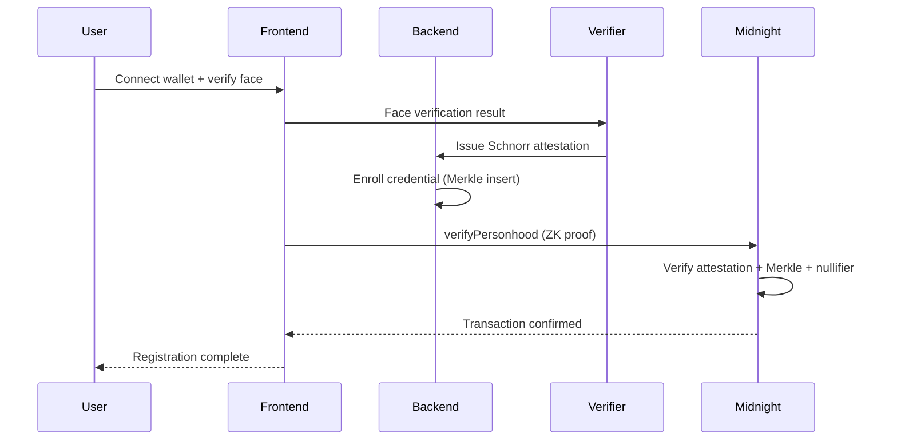
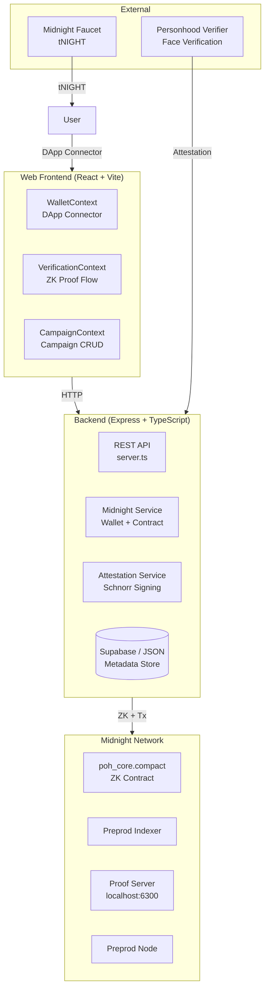
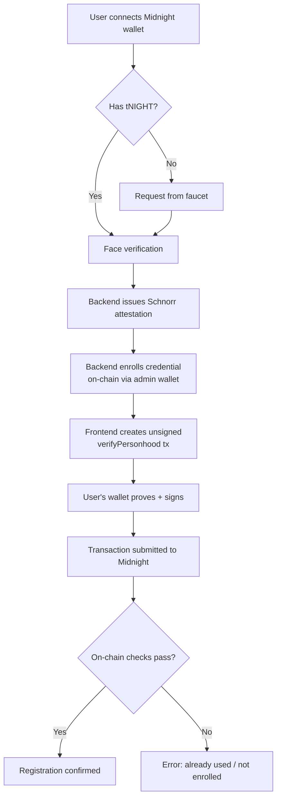
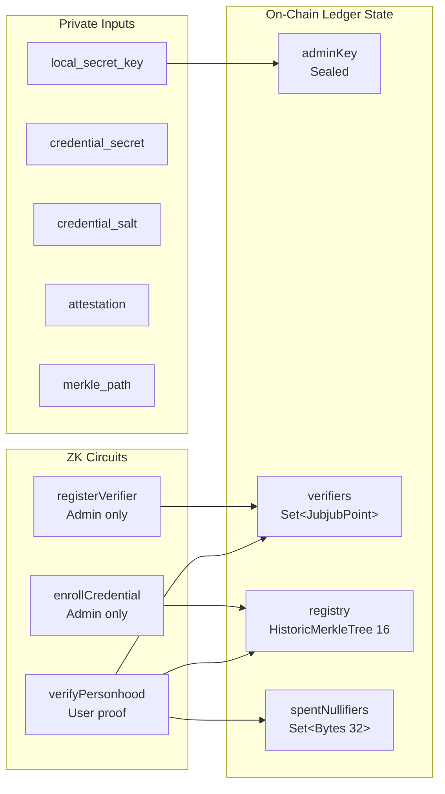

# Anonimus

**Privacy-preserving Proof-of-Humanity + Uniqueness as a Service on [Midnight Network](https://midnight.network).**

Anonimus lets applications answer *"is this a real, unique human?"* — without ever collecting or storing identity or biometric data on-chain.

[](LICENSE)
[](https://midnight.network)
[](https://www.typescriptlang.org)

---

## Table of Contents

- [How It Works](#how-it-works)
- [Architecture](#architecture)
- [Smart Contract](#smart-contract)
- [Backend API](#backend-api)
- [Frontend](#frontend)
- [Development](#development)
- [Deployment](#deployment)
- [Environment Variables](#environment-variables)
- [Project Structure](#project-structure)
- [License](#license)

---

## How It Works

Anonimus separates **personhood verification** from **on-chain proof**, keeping biometric data entirely off-chain and never on the Midnight ledger.



**Key privacy properties:**
- The on-chain observer sees **only** nullifiers and Merkle roots — never credentials, attestations, or biometric data
- Each campaign produces a **unique, unlinkable nullifier** per credential
- The attestation signature is a **private ZK input** — never published

---

## Architecture

### System Overview



### Registration Flow



### Contract Architecture



---

## Smart Contract

**File:** `contracts/poh_core.compact`

### Compilation

| Property | Value |
|----------|-------|
| Compiler | `compactc` v0.31.1 |
| Language | Compact v0.23.0 |
| Runtime | `compact-runtime` v0.16.0 |
| Pragma | `language_version >= 0.22` |

### On-Chain Contract

| Property | Value |
|----------|-------|
| Contract Address | `85b153c710b98cf0b23a6e470c20422bcb685aa4439795bb2becaaa6da49a37f` |
| Network | Midnight PREPROD |
| Deployed By | Backend admin wallet |

### Compiled Circuits

**8 circuits** compiled from `poh_core.compact`:

| Circuit | Type | Proof | Arguments | Returns | Description |
|---------|------|-------|-----------|---------|-------------|
| `deriveCredId` | pure | No | `credSecret: Bytes<32>` | `Bytes<32>` | Derive credential ID from secret |
| `deriveCredIdField` | pure | No | `credSecret: Bytes<32>` | `Field` | Derive credential ID as field element |
| `deriveCommitment` | pure | No | `credSecret: Bytes<32>`, `salt: Bytes<32>` | `Bytes<32>` | Create Pedersen commitment from secret + salt |
| `registerVerifier` | admin | Yes | `vk: JubjubPoint` | `()` | Register a trusted verifier's public key |
| `removeVerifier` | admin | Yes | `vk: JubjubPoint` | `()` | Remove a verifier from the trusted set |
| `enrollCredential` | admin | Yes | `commitment: Bytes<32>` | `()` | Insert credential commitment into Merkle registry |
| `verifyPersonhood` | user | Yes | `campaignId: Bytes<32>` | `()` | ZK proof: attestation + Merkle + nullifier |
| `isVerifierTrusted` | admin | Yes | `vk: JubjubPoint` | `Boolean` | Check if a verifier key is registered |

**4 admin circuits** (require admin key witness):
- `registerVerifier` — adds a Schnorr verification key to the trusted set
- `removeVerifier` — removes a verification key
- `enrollCredential` — inserts a Pedersen commitment into the Merkle registry
- `isVerifierTrusted` — queries whether a key is in the trusted set

**3 pure circuits** (callable off-chain via `pureCircuits`):
- `deriveCredId` — deterministic credential ID derivation
- `deriveCredIdField` — same as above, as field element
- `deriveCommitment` — Pedersen commitment from secret + salt

**1 user circuit** (ZK proof, verified on-chain):
- `verifyPersonhood` — proves attestation validity + Merkle membership + fresh nullifier in a single ZK proof

### Compiled Witnesses

**8 witnesses** (private inputs resolved by the runtime):

| Witness | Arguments | Returns | Used By |
|---------|-----------|---------|---------|
| `local_secret_key` | — | `Bytes<32>` | `constructor`, `registerVerifier`, `enrollCredential`, `isVerifierTrusted`, `removeVerifier` |
| `get_credential_secret` | — | `Bytes<32>` | `verifyPersonhood` |
| `get_credential_salt` | — | `Bytes<32>` | `verifyPersonhood` |
| `get_registry_path` | `commitment: Bytes<32>` | `MerkleTreePath` | `verifyPersonhood` |
| `get_attestation` | — | `SchnorrSignature` | `verifyPersonhood` |
| `get_expiration` | — | `Field` | `verifyPersonhood` |
| `getAttestedVerifierPk` | — | `JubjubPoint` | `verifyPersonhood` |
| `getSchnorrReduction` | `challengeHash: Field` | `(Field, Uint<253>)` | `verifyPersonhood` |

### On-Chain Ledger State

**4 ledger fields:**

| Field | Index | Storage | Type | Description |
|-------|-------|---------|------|-------------|
| `adminKey` | 0 | Cell | `Bytes<32>` | Admin public key (derived from deployer's secret) |
| `verifiers` | 1 | Set | `Set<JubjubPoint>` | Trusted verifier public keys |
| `registry` | 2 | HistoricMerkleTree | `HistoricMerkleTree<16, Bytes<32>>` | Credential commitment Merkle tree (depth 16 = 65,536 leaves) |
| `spentNullifiers` | 3 | Set | `Set<Bytes<32>>` | Campaign-scoped nullifiers (prevents double-registration) |

### ZK Proof Verifies Three Conditions Simultaneously

1. A trusted verifier signed an attestation over the user's credential ID
2. The credential commitment exists in the on-chain registry (Merkle proof)
3. This credential has not been used in this campaign before (nullifier check)

### Patterns Used

- Domain-separated `persistentHash` with `pad(32, "anonimus:<domain>:")` prefixes
- `HistoricMerkleTree<16>` for credential registry (65,536 leaves)
- Campaign-scoped nullifiers for per-campaign uniqueness
- Witness-derived admin key (same pattern as zk-loan)
- `persistentCommit` with random salt — defeats leaf-guessing
- `disclose()` required on witness-derived values entering ledger ops/exports

---

## Backend API

**File:** `src/server.ts`

### Endpoints

| Method | Path | Description |
|--------|------|-------------|
| `GET` | `/api/health` | Server health + Midnight readiness |
| `GET` | `/api/network` | Network info (faucet URL, explorer URL) |
| `GET` | `/api/verifier` | Current verifier public key |
| `GET` | `/api/campaigns` | List all campaigns |
| `POST` | `/api/campaigns` | Create a campaign |
| `GET` | `/api/campaigns/:id` | Get campaign details |
| `GET` | `/api/campaigns/:id/registrations` | List registrations for a campaign |
| `POST` | `/api/register-unsigned` | Create unsigned registration tx for user's wallet |

### Middleware

- CORS (configurable origin)
- JSON body parsing
- Security headers (`X-Content-Type-Options`, `X-Frame-Options`)

---

## Frontend

**Directory:** `web/`

### Key Pages

| Page | Description |
|------|-------------|
| `HomePage` | Landing page with role selection |
| `JoinWalletPage` | Connect Midnight wallet via DApp Connector |
| `VerificationPage` | Face verification + ZK proof flow |
| `CampaignDetailPage` | View campaign + register |
| `CreateCampaignPage` | Create a new campaign |
| `RegistrationsPage` | View campaign registrations |

### Wallet Integration

Uses the Midnight DApp Connector API:

```typescript
// Connect to Lace or 1AM wallet
const connectedAPI = await window.midnight.mnLace.connect('preprod');

// Create, prove, and submit transactions
const tx = await createUnprovenCallTx(circuit, ...);
const balanced = await connectedAPI.balanceUnsealedTransaction(hex);
await connectedAPI.submitTransaction(balancedTx);
```

### ZK Artifacts

Wallet's `FetchZkConfigProvider` fetches ZK artifacts from the frontend's URL:

```
web/public/keys/     ← prover/verifier keys
web/public/zkir/     ← ZKIR/bzkir files
```

---

## Development

### Prerequisites

- **Node.js** >= 22.0.0
- **Yarn** 1.22.x
- **WSL2** (Ubuntu 24.04) — Compact compiler is Unix-only
- **Docker** (for local devnet)

### Setup

```bash
# Install dependencies
yarn install

# Compile the Compact contract (WSL only)
compact compile contracts/poh_core.compact contracts/managed/poh_core

# Type check
yarn typecheck

# Run tests
yarn test

# Start local devnet (Docker)
docker compose -f devnet.yml up

# Start backend
yarn server
```

### Local Devnet

Three Docker services (`devnet.yml`):

| Service | Port | Health Check |
|---------|------|--------------|
| Node | `:9944` | `/health` |
| Indexer | `:8088` | `/api/v4/graphql` |
| Proof Server | `:6300` | `/health` |

---

## Deployment

### PREPROD (Live)

| Component | Status | Details |
|-----------|--------|---------|
| Backend | ✅ Live | VPS `43.157.12.242:3001` via PM2 |
| Frontend | ✅ Live | [anonimus-proof.vercel.app](https://anonimus-proof.vercel.app) |
| Contract | ✅ Deployed | `85b153c710b98cf0b23a6e470c20422bcb685aa4439795bb2becaaa6da49a37f` |
| Verifier | ✅ Registered | Public key on-chain |
| Wallet | ✅ Synced | FluentWalletBuilder on preprod |

### Deployer Wallet

The backend wallet signs admin operations (enrollment, verifier registration). Participant transactions are always signed by the user's own wallet.

**Funding:** tNIGHT from [preprod faucet](https://midnight-tmnight-preprod.nethermind.dev/)

### Architecture Decision: Admin Enrollment

```
User flow:    Backend enrolls credential → User signs verifyPersonhood
Admin flow:   Backend signs registerVerifier / enrollCredential
```

The deployer wallet is the **admin** — it handles enrollment and verifier management. Users never delegate transaction signing.

---

## Environment Variables

Copy `.env.example` to `.env`:

```bash
cp .env.example .env
```

| Variable | Required | Description |
|----------|----------|-------------|
| `MIDNIGHT_NETWORK` | ✅ | `local` or `preprod` |
| `DEPLOYER_WALLET_SECRET` | ✅ | 24-word mnemonic (admin wallet) |
| `PORT` | No | Server port (default: `3001`) |
| `CORS_ORIGIN` | No | Frontend URL for CORS |
| `PRIVATE_STATE_PASSWORD` | No | LevelDB encryption password |
| `SUPABASE_URL` | No | Supabase project URL |
| `SUPABASE_ANON_KEY` | No | Supabase anon key |
| `SUPABASE_SERVICE_ROLE_KEY` | No | Supabase service role key |
| `MIDNIGHT_PROOF_SERVER` | No | Proof server URL (default: `http://127.0.0.1:6300`) |
| `WALLET_STATE_DIR` | No | Wallet state cache directory |

---

## Project Structure

```
anonimus/
├── contracts/
│   ├── poh_core.compact          # Main ZK contract (Compact language)
│   ├── witnesses.ts              # Witness implementations + test verifier
│   ├── index.ts                  # Contract exports + CompiledContract setup
│   └── managed/poh_core/         # GENERATED by compactc (don't edit)
│       ├── contract/index.js     # TypeScript bindings + pureCircuits
│       └── keys/ + zkir/         # ZK artifacts
├── src/
│   ├── server.ts                 # Express REST API
│   ├── midnight-service.ts       # Wallet + contract operations
│   ├── wallet.ts                 # FluentWalletBuilder + MidnightWalletProvider
│   ├── config.ts                 # Network config (local / preprod)
│   ├── providers.ts              # Proof server, indexer, private state
│   ├── store.ts                  # Supabase + JSON fallback
│   ├── attestation-service.ts    # Schnorr keypair + attestation issuance
│   └── fast-sync/                # Wallet state save/restore (for future use)
├── web/
│   ├── src/
│   │   ├── contexts/             # Wallet, Verification, Campaign contexts
│   │   ├── pages/                # 26 React pages
│   │   ├── components/           # UI components
│   │   └── lib/api.ts            # Backend API client
│   └── public/
│       ├── keys/                 # ZK prover/verifier keys
│       └── zkir/                 # ZKIR files
├── supabase/
│   └── schema.sql                # Database schema (campaigns, registrations, RLS)
├── scripts/                      # Deployment + tooling scripts
├── devnet.yml                    # Docker Compose for local devnet
├── .env.example                  # Environment variable template
└── package.json                  # Dependencies + scripts
```

---

## Key Design Decisions

| Decision | Rationale |
|----------|-----------|
| **Admin enrollment + user verification** | Backend signs `enrollCredential` (admin op); user signs `verifyPersonhood` (personal op). No delegation of signing. |
| **Campaign-scoped nullifiers** | One credential can participate in multiple campaigns, but only once per campaign. Nullifiers are unlinkable across campaigns. |
| **Domain-separated hashing** | `pad(32, "anonimus:<domain>:")` prefixes prevent hash collisions across different use cases. |
| **FluentWalletBuilder** | Official testkit-js pattern — handles SDK versioning, `forks.v9`, and internal config automatically. |
| **Supabase + JSON fallback** | Production-ready metadata store with local fallback for development. |
| **No mocks** | All PoH, biometric, ZK proof, and cryptographic operations are real implementations. |

---

## Known Limitations

1. **Initial wallet sync** — First-time DUST sync from genesis takes ~2-3 hours on preprod. Future optimization via `moth-wallet` fast-sync or wallet-sdk 2.x.
2. **Face verification** — Client-side `face-api.js` is a placeholder; production requires a real personhood provider.
3. **Single campaign per registration** — Each `verifyPersonhood` call is scoped to one campaign ID.
4. **Merkle tree depth** — `HistoricMerkleTree<16>` supports 65,536 credentials; revisit depth at scale.

---

## License

Apache License 2.0 — see [LICENSE](LICENSE).

---

## Contributing

1. Fork the repository
2. Create a feature branch
3. Commit with clear messages
4. Open a pull request

All contributions must pass `yarn typecheck` and `yarn test` before merge.
